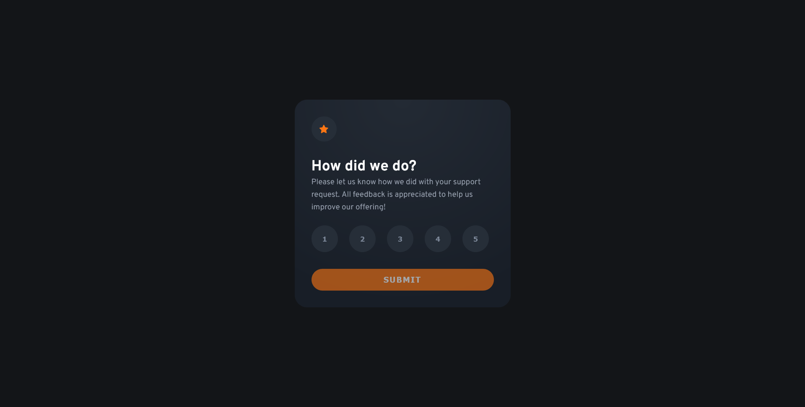

# Frontend Mentor - Interactive rating component

This is a solution to the [Interactive rating component challenge on Frontend Mentor](https://www.frontendmentor.io/challenges/interactive-rating-component-koxpeBUmI). Frontend Mentor challenges help you improve your coding skills by building realistic projects.

## Table of contents

-   [Screenshot](#screenshot)
-   [Links](#links)
-   [Built with](#built-with)
-   [Author](#author)

### Screenshot

### Links

-   Solution URL: [Github](https://github.com/ezeroualnajat/Interactive-rating-component)
-   Live Site URL: [Preview](https://najatezeroual.me/interactive-rating-component)

### Built with

-   Semantic HTML5 markup
-   CSS custom properties
-   Flexbox

## Author

-   Website - [Najat Ezeroual](https://najatezeroual.me)
-   Frontend Mentor - [@ezeroualnajat](https://www.frontendmentor.io/profile/ezeroualnajat)
